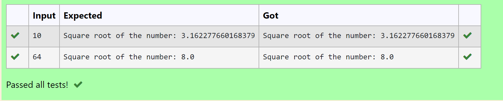

# Find the square root of a number

## AIM:
To write a program to find the square root of a number.

## EQUIPMENT'S REQUIRED:
1. Hardware – PCs
2. Anaconda – Python 3.7 Installation / Moodle-Code Runner

## ALGORITHM:
1. Define a function.
2. Assign number_iters = 100 in the function to perform 100 iteratios.
3. Set i = 0.
4. Calculate  number = 0.5 * (number + a / number) for 100 iterations.
5. Return number

## PROGRAM:
```
#Program to to find the square root for the given number(newton's method) using function.
#Developed by: Aashima Nazreen Sayeed S
#RegisterNumber: 21500368
def root(x):
    for i in range(10):
        x=0.5*(x+b/x)
    print("Square root of the number:",x)
x=int(input())
b=x
root(x)
```

## OUTPUT:



## RESULT:
Thus the program to find the square root for the given number(newton's method) using function is written and verified using python programming.
